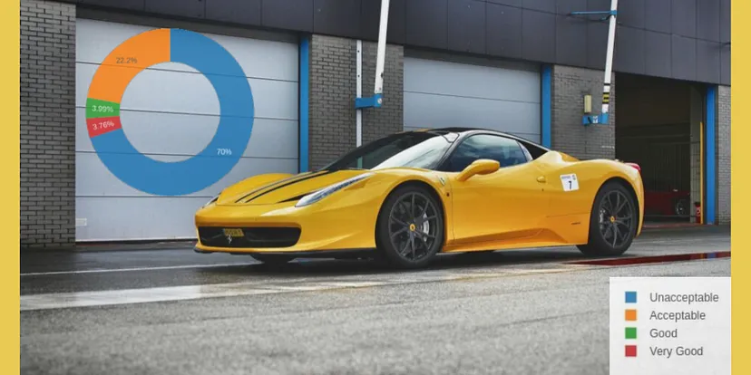
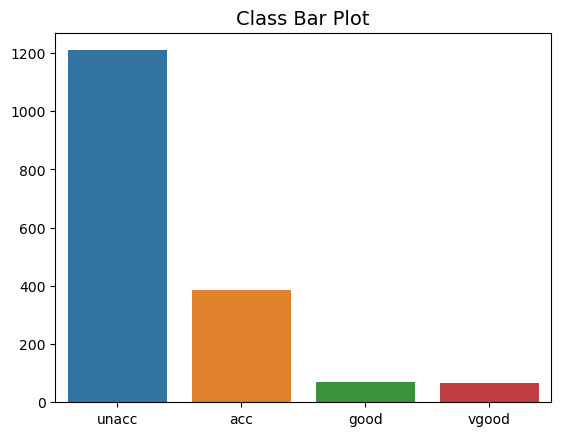

# Car Aceptibility Predictor

## Table of Content
* [Overview](#overview)
* [Motivation](#motivation)
* [Problem Solving Steps](#problem-solving-steps)
* [Source of Dataset](#source-of-dataset)
* [Data Cleaning Techniques](#data-cleaning-techniques)
* [Exploratory Data Analysis](#exploratory-data-analysis)
* [Model Building](#model-building)
* [Model Performance](#model-performance)
* [Deployment](#deployment)

## Overview

In this project, we build a model that predicts whether a car is acceptable or not based on different features of the car. There are 4 measures for acceptability and they are; 
* Good
* Very Good
* Acceptable
* Unacceptable

</br></br>

<div align="center">
  
</div>

## Motivation

Every year, new car models hit the market. With close to two hundred models available, choosing just one can be overwhelming. Aside from the purchase price, other factors will determine the choice of vehicle you settle on.

When buying a new car, there are many factors to consider. The car needs to fulfill your wants, needs, and lifestyle demands. Also, you’ll want to consider the resale value, costs of ownership, desired features, incentive and trade-in options, and pricing and financing.

Buying a car is usually a pretty big purchase. You will likely be using it for years to come, while you may also be paying for it for a few years. With this in mind, it makes sense to take your time and find the car that is right for and there are various factors to consider when buying a car.

## Problem Solving Steps

The following steps will be followed in building this project
1. Load the data into a dataframe
2. Perform Data Preprocessing and feature creation
3. Perform Exploratory Data Analysis and get valuable insights from the data
4. Perform Feature selection
5. Build models and select the best model that fits the data
6. Integrate the model with the User Interface that is created using Flask and Bootstrap
7. Deploy the Machine Learning web app a cloud platform.


## Source of Dataset

https://www.kaggle.com/datasets/subhajeetdas/car-acceptability-classification-dataset

## Data Cleaning Techniques

The only data preprocessing required in the data set was conversion of categorical variables to numbers so that it can be accepted by the model. Label Encoding was the method used to convert categorical variables to numerical veriables. The code used is below; 

```python
# import encoder 
from sklearn.preprocessing import LabelEncoder

# instanciate LabelEncoder
encoder = LabelEncoder()
data = X.copy()

get_mappings = {}
for col in list(data.columns):
    data[col] = encoder.fit_transform(data[col])
    get_mappings[col] = dict(zip(encoder.classes_, 
                                 encoder.transform(encoder.classes_))) 
```

## Exploratory Data Analysis
The plot below is the distribution of the target variable. </br></br>

<div align="center">
  
</div>

</br></br>
From the plot above, it can be seen that this is a multi-class classification and there is an imbalance in the target classes. This was taken into account when building the models.


## Model Building

4 Models were built. They include;
- Logistic Regression
- Random Forest Classifier
- Decision Tree Classifiefer
- KNeighbors Classifier and
- Support Vector Classifier

## Model Performance

## Deployment

## Future scope of project
